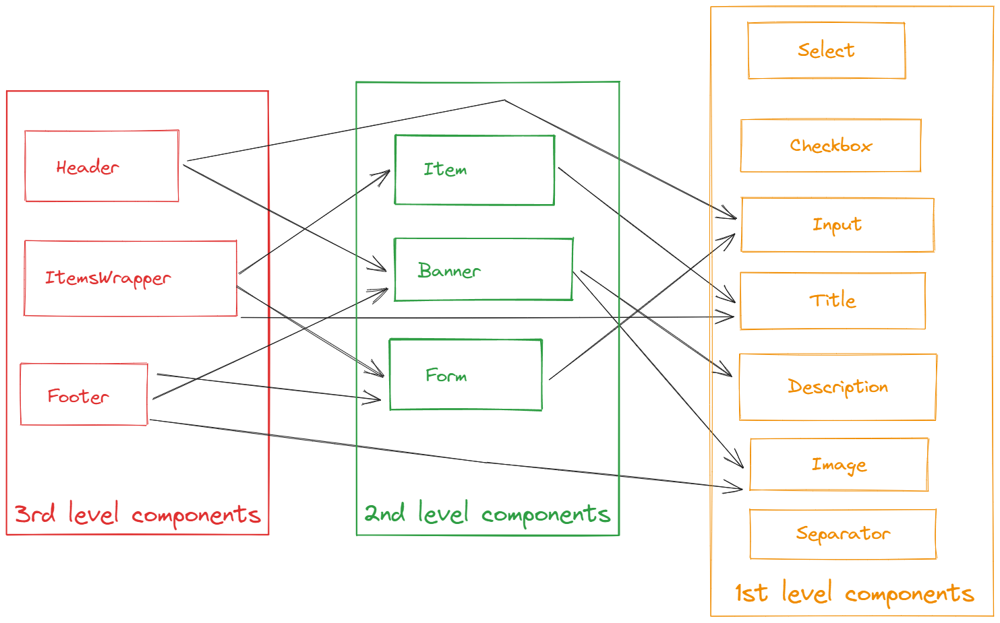

# Création des composants

Il existe 3 types de composants : les composants de 1er niveau (natifs) puis les composants de 2ème et troisième niveau qui sont des conteneurs.
Les composants de plus haut niveau contiènes ceux de niveaux inférieurs, par exemple un composant de 3ème niveau peut contenir un composant de 2ème et de 1èer niveau.



| Saisie de données | Conteneurs   | Affichage   |
| :---------------- | :----------- | :---------- |
| AreaField         | Item         | Title       |
| Checkbox          | Banner       | Description |
| PasswordField     | Form         | Sepatator   |
| ColorPicker       | Header       | Image       |
| Radio             | Footer       | Button      |
| Selector          | ItemsWrapper |             |
| TextField         |              |             |
| DatePicker        |              |             |
 
Chaque composant à des paramètres facultatifs et obligatoires, veuillez consulter leurs documentation pour plus d'informations.  
Dans le cas où un paramètre obligatoire est manquant, une erreur surviendra et l'interface ne sera pas affichée.

Les propriétés sont passés dans un objet `props`, et les composants enfants sont passés dans un objet `children`.

:warning: **Attention !** Les composants de 1er niveau ne peuvent pas avoir de composants enfants.

Exemple de requête JSON

```json title="Request.json"
{
  "context": {
    // ...
  },
  "composants": {
    "header": {
        "props": {
            "title": "Hello",
            "description": "Simple petite description de placeholder",
            "image": "https://via.placeholder.com/150"
        },
        "button": {
            "props": {
                "text": "Cliquez ici",
                "color": "#000000",
                "background": "#ffffff"
            },
            "title": "Hello",
        }
    },
    "itemsWrapper": {
            "props": {
                "title": "Hello",
                "description": "Simple petite description de placeholder",
                "image": "https://via.placeholder.com/150",
                "items": {
                {
                    "title": "Premier item",
                    "description": "10€",
                    "button": {
                        "display": "Acheter",
                        "callback": "buy_item",
                        "style": ["dark", "rounded"]
                    },
                    "select": {
                        "options": {
                            "1": "1",
                            "2": "2",
                            "3": "3"
                        }
                    },
                    "style": ["light", "transparent"]
                }
                }
            },
            "button": {
                "props": {
                    "text": "Cliquez ici",
                    "color": "#000000",
                    "background": "#ffffff"
                },
                "title": "Hello",
            }
        },
    },
}
```
